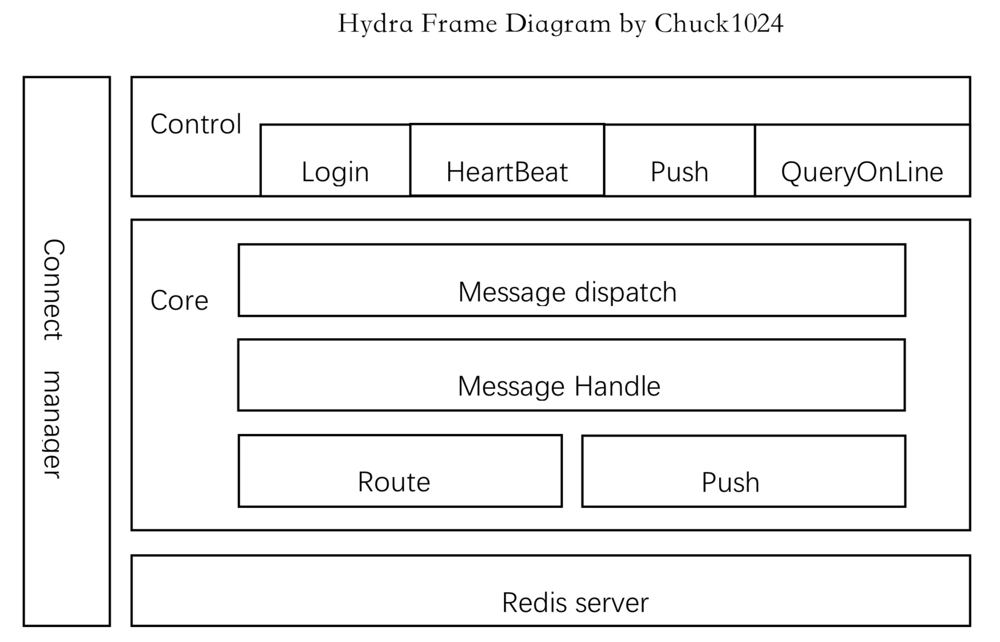

# hydra

hydra 九头蛇（HYDRA）是美国漫威漫画旗下超级反派组织

## Author

```
author: Chuck1024
email : chuck.ch1024@outlook.com
```

## 介绍

### 使用的包
>* [godog](https://github.com/chuck1024/godog)
>* [websocket](https://github.com/gorilla/websocket/)

### 简介
hydra是一个基于websocket实现的简单的push服务，实现客户度登录、心跳、服务端对客户端的push数据、查询用户是否在线、多个实例相互路由等功能。

### 方案设计
框架图：
```
说明：
    1、control层：hydra接入层，提供给客户端的有登录、心跳等接口，提供给服务端的有push服务和查询用户是否在线等接口；
    2、core层：hydra核心部分，message dispatch为数据分发，根据不同的命令字分发数据。message handle为分发数据后的数据处理。
            push为服务端push数据的处理，包含decode和encode等，route为当push请求该实例，但是需要接收push的用户的连接并不在该实例，
            则需要路由到连接所在实例；
    3、redis server：主要有两个作用，一、保存用户连接所在实例地址，方便查询用户连接所在实例；二、保存用户连接状态，查询是否在线；
    4、connect manager：主要用于维持和客户端之间的连接通道，主要负责和客户端交互。
```

### 使用
```
为了方便在同一台机器上能够测试，需要修改redis保存用户连接状态的value，需要修改为ip+port的格式。需要更改service/core/push.go的30和
service/route/route.go的15行和cache/cache.go的38行注释，并将相应的下一行注释删除掉。

1、启动第一个实例，监听端口为10240
>$ go run main.go
[2018/08/29 17:40:51.223] INFO  [httpserver.go:99] [AddHandlerFunc] Add/Replace [addr: /hydra] ok
[2018/08/29 17:40:51.224] INFO  [httpserver.go:99] [AddHandlerFunc] Add/Replace [addr: /push] ok
[2018/08/29 17:40:51.224] INFO  [httpserver.go:99] [AddHandlerFunc] Add/Replace [addr: /query] ok
[2018/08/29 17:40:51.224] INFO  [httpserver.go:99] [AddHandlerFunc] Add/Replace [addr: /route] ok
[2018/08/29 17:40:51.224] INFO  [godog.go:41] [Run] start
[2018/08/29 17:40:51.224] INFO  [signal.go:44] [Signal] register signal ok
[2018/08/29 17:40:51.224] INFO  [httpserver.go:66] [Serve] Http try to listen port: 10240
[2018/08/29 17:40:51.224] INFO  [tcpserver.go:57] [Run] no tcp serve port
[2018/08/29 17:40:51.224] INFO  [godog.go:84] [Run] Hasn't tcp server port

2、修改conf.json的httpPort为10241，启动第二个实例
>$ go run main.go
[2018/08/29 17:39:11.249] INFO  [httpserver.go:99] [AddHandlerFunc] Add/Replace [addr: /hydra] ok
[2018/08/29 17:39:11.250] INFO  [httpserver.go:99] [AddHandlerFunc] Add/Replace [addr: /push] ok
[2018/08/29 17:39:11.250] INFO  [httpserver.go:99] [AddHandlerFunc] Add/Replace [addr: /query] ok
[2018/08/29 17:39:11.250] INFO  [httpserver.go:99] [AddHandlerFunc] Add/Replace [addr: /route] ok
[2018/08/29 17:39:11.250] INFO  [godog.go:41] [Run] start
[2018/08/29 17:39:11.250] INFO  [signal.go:44] [Signal] register signal ok
[2018/08/29 17:39:11.250] INFO  [httpserver.go:66] [Serve] Http try to listen port: 10241
[2018/08/29 17:39:11.250] INFO  [tcpserver.go:57] [Run] no tcp serve port
[2018/08/29 17:39:11.250] INFO  [godog.go:84] [Run] Hasn't tcp server port

3、启动第一个客户端，并输入login登录第一个实例，uuid为10240，注意客户端自己每分钟自动发送心跳
>$ cd client
>$ go build client 
>$ ./client -addr 127.0.0.1:10240 -uuid 10240
login
received:  {1 login {200 ok}}

此时第一个实例：
[2018/08/29 17:40:54.669] DEBUG [wsControl.go:23] [WsControl] 127.0.0.1:59574 connected.
[2018/08/29 17:40:57.783] DEBUG [handle.go:21] [HandleData] receive message:{"id":"1","cmd":"login","uuid":10240}
[2018/08/29 17:40:57.784] DEBUG [handle.go:48] [HandleData] handle data. id: 1, cmd:login
[2018/08/29 17:40:57.785] DEBUG [handle.go:59] [HandleData] login uuid: 10240
[2018/08/29 17:40:57.785] DEBUG [cache.go:40] [SetUuid] key: hydra:uuid:10240 value:10.235.202.86:10240
[2018/08/29 17:40:57.786] DEBUG [cache.go:48] [SetUuid] set key success. key:hydra:uuid:10240
[2018/08/29 17:40:57.786] DEBUG [handle.go:34] [HandleData] handle data. response: {1 login {200 ok}}

4、启动第二个客户端，并输入login登录第二个实例，uuid为10241
>$ ./client -addr 127.0.0.1:10241 -uuid 10241
login
received:  {1 login {200 ok}}

此时第二个实例：
[2018/08/29 17:40:59.765] DEBUG [wsControl.go:23] [WsControl] 127.0.0.1:59578 connected.
[2018/08/29 17:41:02.254] DEBUG [handle.go:21] [HandleData] receive message:{"id":"1","cmd":"login","uuid":10241}
[2018/08/29 17:41:02.254] DEBUG [handle.go:48] [HandleData] handle data. id: 1, cmd:login
[2018/08/29 17:41:02.255] DEBUG [handle.go:59] [HandleData] login uuid: 10241
[2018/08/29 17:41:02.255] DEBUG [cache.go:40] [SetUuid] key: hydra:uuid:10241 value:10.235.202.86:10241
[2018/08/29 17:41:02.257] DEBUG [cache.go:48] [SetUuid] set key success. key:hydra:uuid:10241
[2018/08/29 17:41:02.257] DEBUG [handle.go:34] [HandleData] handle data. response: {1 login {200 ok}}

5、查询用户是否在线
>$ curl -X POST http://127.0.0.1:10240/query -d '{"uuid":10240}'
{"code":200,"msg":"ok","data":{"IsOnline":true}}

服务端日志：
[2018/08/29 17:41:34.263] INFO  [queryControl.go:46] [QueryControl] received request: {10240}
[2018/08/29 17:41:34.264] DEBUG [cache.go:55] [GetUuid] key:hydra:uuid:10240
[2018/08/29 17:41:34.264] DEBUG [cache.go:73] [GetUuid] localAddr: 10.235.202.86:10240
[2018/08/29 17:41:34.264] DEBUG [httplib.go:263] [LogGetResponseInfo] HANDLE_LOG:request={Method:POST URL:/query User_id: X_Auth_Token: Form:map[] Body:{"uuid":10240}},response={"code":200,"msg":"ok","data":{"IsOnline":true}}

>$ curl -X POST http://127.0.0.1:10240/query -d '{"uuid":10241}'
{"code":200,"msg":"ok","data":{"IsOnline":true}}
[2018/08/29 17:41:37.807] INFO  [queryControl.go:46] [QueryControl] received request: {10241}
[2018/08/29 17:41:37.807] DEBUG [cache.go:55] [GetUuid] key:hydra:uuid:10241
[2018/08/29 17:41:37.807] DEBUG [cache.go:73] [GetUuid] localAddr: 10.235.202.86:10241
[2018/08/29 17:41:37.808] DEBUG [httplib.go:263] [LogGetResponseInfo] HANDLE_LOG:request={Method:POST URL:/query User_id: X_Auth_Token: Form:map[] Body:{"uuid":10241}},response={"code":200,"msg":"ok","data":{"IsOnline":true}}

6、实例收到用户心跳：
[2018/08/29 17:41:54.670] DEBUG [handle.go:21] [HandleData] receive message:{"id":"2","cmd":"heartbeat"}
[2018/08/29 17:41:54.671] DEBUG [handle.go:48] [HandleData] handle data. id: 2, cmd:heartbeat
[2018/08/29 17:41:54.671] DEBUG [handle.go:71] [HandleData] heartbeat uuid: 10240
[2018/08/29 17:41:54.671] DEBUG [cache.go:55] [GetUuid] key:hydra:uuid:10240
[2018/08/29 17:41:54.672] DEBUG [cache.go:73] [GetUuid] localAddr: 10.235.202.86:10240
[2018/08/29 17:41:54.673] DEBUG [cache.go:40] [SetUuid] key: hydra:uuid:10240 value:10.235.202.86:10240
[2018/08/29 17:41:54.673] DEBUG [cache.go:48] [SetUuid] set key success. key:hydra:uuid:10240
[2018/08/29 17:41:54.673] DEBUG [handle.go:34] [HandleData] handle data. response: {2 heartbeat {200 ok}}

7、向用户10240发送push数据，连接的是第一个实例
>$ curl -X POST http://127.0.0.1:10240/push -d '{"id":"1","uuid":10240,"msg":"test success"}'
{"code":200,"msg":"ok","data":{"Seq":"20180829174214102401"}}

第一个客户端：
received:  {20180829174214102401 push test success}

此时第一个实例：
[2018/08/29 17:42:14.379] INFO  [pushControl.go:48] [PushControl] received request: {1 10240 test success}
[2018/08/29 17:42:14.379] DEBUG [cache.go:110] [GetPush] key:hydra:push:1
[2018/08/29 17:42:14.379] DEBUG [cache.go:116] [GetPush] redis check no repeat key: hydra:push:1
[2018/08/29 17:42:14.379] DEBUG [cache.go:55] [GetUuid] key:hydra:uuid:10240
[2018/08/29 17:42:14.380] DEBUG [cache.go:73] [GetUuid] localAddr: 10.235.202.86:10240
[2018/08/29 17:42:14.380] DEBUG [cache.go:95] [SetPush] key: hydra:push:1
[2018/08/29 17:42:14.380] DEBUG [cache.go:103] [SetPush] set key success. key: hydra:push:1
[2018/08/29 17:42:14.380] DEBUG [httplib.go:263] [LogGetResponseInfo] HANDLE_LOG:request={Method:POST URL:/push User_id: X_Auth_Token: Form:map[] Body:{"id":"1","uuid":10240,"msg":"test success"}},response={"code":200,"msg":"ok","data":{"Seq":"20180829174214102401"}}
[2018/08/29 17:42:14.380] DEBUG [handle.go:21] [HandleData] receive message:{"id":"20180829174214102401","cmd":"push","Data":{"code":200,"result":"ok"}}
[2018/08/29 17:42:14.380] DEBUG [handle.go:48] [HandleData] handle data. id: 20180829174214102401, cmd:push
[2018/08/29 17:42:14.380] DEBUG [handle.go:105] [HandleData] push response: &{20180829174214102401 push {200 ok}}

8、向用户10241发送push数据，连接的是第一个实例，测试路由功能
>$ curl -X POST http://127.0.0.1:10240/push -d '{"id":"2","uuid":10241,"msg":"test success"}'
{"code":200,"msg":"ok","data":{"Seq":"20180829174226102411"}}

第二个客户端：
received:  {20180829174226102411 push test success}

此时第一个实例：
[2018/08/29 17:42:26.813] INFO  [pushControl.go:48] [PushControl] received request: {2 10241 test success}
[2018/08/29 17:42:26.813] DEBUG [cache.go:110] [GetPush] key:hydra:push:2
[2018/08/29 17:42:26.813] DEBUG [cache.go:116] [GetPush] redis check no repeat key: hydra:push:2
[2018/08/29 17:42:26.814] DEBUG [cache.go:55] [GetUuid] key:hydra:uuid:10241
[2018/08/29 17:42:26.814] DEBUG [cache.go:73] [GetUuid] localAddr: 10.235.202.86:10241
[2018/08/29 17:42:26.814] DEBUG [httplib.go:194] [SendToServer] send to server req:&common.RouteReq{Id:"2", Uuid:0x2801, Msg:"test success"}
[2018/08/29 17:42:26.814] DEBUG [httplib.go:82] [doRequest] start connection[to: http://10.235.202.86:10241/route, method: POST, content: {"Id":"2","Uuid":10241,"Msg":"test success"}]

路由到第二个实例，第二个实例日志：
[2018/08/29 17:42:26.816] INFO  [routeControl.go:46] [RouteControl] received request: {2 10241 test success}
[2018/08/29 17:42:26.816] DEBUG [cache.go:55] [GetUuid] key:hydra:uuid:10241
[2018/08/29 17:42:26.817] DEBUG [cache.go:73] [GetUuid] localAddr: 10.235.202.86:10241
[2018/08/29 17:42:26.817] DEBUG [cache.go:95] [SetPush] key: hydra:push:2
[2018/08/29 17:42:26.817] DEBUG [cache.go:103] [SetPush] set key success. key: hydra:push:2
[2018/08/29 17:42:26.817] DEBUG [httplib.go:263] [LogGetResponseInfo] HANDLE_LOG:request={Method:POST URL:/route User_id: X_Auth_Token: Form:map[] Body:{"Id":"2","Uuid":10241,"Msg":"test success"}},response={"code":200,"msg":"ok","data":{"Seq":"20180829174226102411"}}
[2018/08/29 17:42:26.818] DEBUG [handle.go:21] [HandleData] receive message:{"id":"20180829174226102411","cmd":"push","Data":{"code":200,"result":"ok"}}
[2018/08/29 17:42:26.818] DEBUG [handle.go:48] [HandleData] handle data. id: 20180829174226102411, cmd:push
[2018/08/29 17:42:26.818] DEBUG [handle.go:105] [HandleData] push response: &{20180829174226102411 push {200 ok}}

第一个实例日志：
[2018/08/29 17:42:26.818] DEBUG [route.go:35] [Route] seq:20180829174226102411
[2018/08/29 17:42:26.818] DEBUG [httplib.go:263] [LogGetResponseInfo] HANDLE_LOG:request={Method:POST URL:/push User_id: X_Auth_Token: Form:map[] Body:{"id":"2","uuid":10241,"msg":"test success"}},response={"code":200,"msg":"ok","data":{"Seq":"20180829174226102411"}}

9、关闭第一个客户端，再查询用户是否在线：
>$ curl -X POST http://127.0.0.1:10240/query -d '{"uuid":10240}'
{"code":200,"msg":"ok","data":{"IsOnline":false}}

第一个实例日志：
[2018/08/29 17:42:34.613] DEBUG [wsControl.go:32] [WsControl] 127.0.0.1:59574 disconnected.
[2018/08/29 17:42:34.614] DEBUG [cache.go:80] [DelUuid] key: hydra:uuid:10240
[2018/08/29 17:42:34.614] DEBUG [cache.go:88] [DelUuid] Del key success. key:hydra:uuid:10240
[2018/08/29 17:42:39.092] INFO  [queryControl.go:46] [QueryControl] received request: {10240}
[2018/08/29 17:42:39.092] DEBUG [cache.go:55] [GetUuid] key:hydra:uuid:10240
[2018/08/29 17:42:39.092] DEBUG [cache.go:61] [GetUuid] get value keyNotExist. key: hydra:uuid:10240
[2018/08/29 17:42:39.092] DEBUG [queryControl.go:52] [QueryControl] uuid[10240] is offline.
[2018/08/29 17:42:39.092] DEBUG [httplib.go:263] [LogGetResponseInfo] HANDLE_LOG:request={Method:POST URL:/query User_id: X_Auth_Token: Form:map[] Body:{"uuid":10240}},response={"code":200,"msg":"ok","data":{"IsOnline":false}}

```

### 写到最后
```
1、更多的实验，在此就不在赘述。
3、读者有任何问题，都可以发邮件与作者联系讨论。
```

## License
hydra is released under the [**MIT LICENSE**](http://opensource.org/licenses/mit-license.php).  
